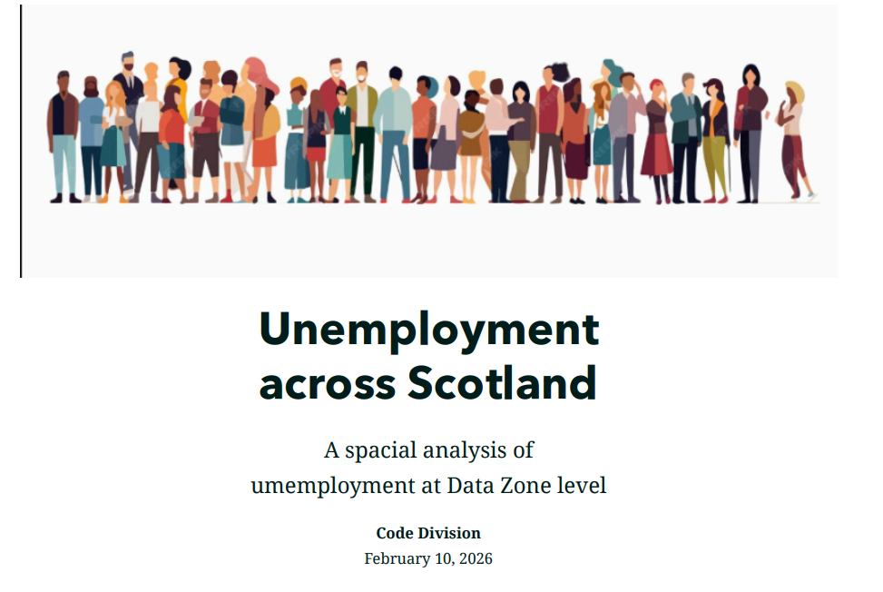
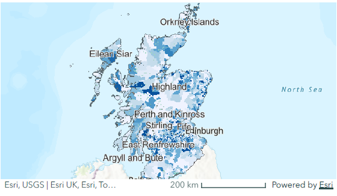
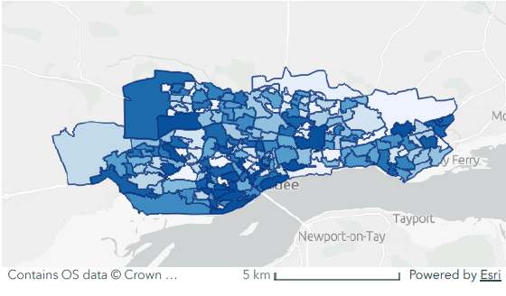
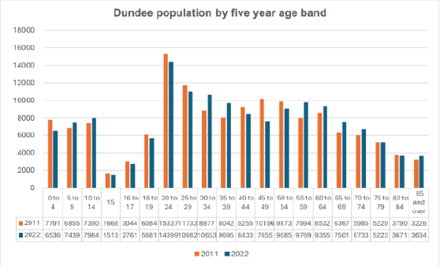
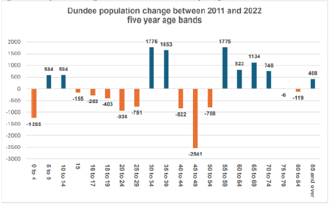
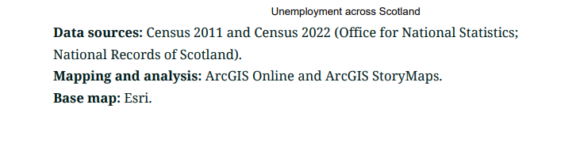

# arcgis-storymap-unemployment-scotland-dundee
ArcGIS Online web map + Instant App + StoryMap using Census 2022 unemployment data (Scotland Data Zones) with Dundee demographic context.
# ArcGIS StoryMap — Unemployment Across Scotland (Census 2022) + Dundee Context

## Live ArcGIS StoryMap / App
https://arcg.is/1Hyif53

## Project Overview
Across two practical sessions, I learned how spatial data can be transformed from a technical output into a narrative tool.
Session 1 focused on building a web map in ArcGIS Online and publishing it as an interactive Instant App.
Session 2 extended the work into a StoryMap, combining multiple maps and supporting visuals into a coherent narrative.

## What I Built

### Session 1 — Web Map + Instant App
- Created an ArcGIS Online web map using **Census 2022** data to visualise unemployment across Scotland at **Data Zone** level.
- Published the map as an **Instant App** (private) and configured presentation features such as titles, legends, and accessible layout.

### Session 2 — StoryMap (Spatial Storytelling)
- Worked collaboratively to combine:
  - a Scotland-wide unemployment map (Data Zones)
  - a Dundee population map (Data Zones)
- Embedded maps within a StoryMap alongside explanatory text and supporting visuals.
- Added a footer with data sources and refined narrative flow to link national patterns to local dynamics.

## Key Insight
This work demonstrated how national unemployment patterns can be interpreted through local demographic context.
Dundee’s population distribution and age-structure evidence helped explain why labour-market pressures can vary within the same city.

## Tools
ArcGIS Online • ArcGIS Instant Apps • ArcGIS StoryMaps • Census 2022 datasets

## Evidence (Screenshots)

### 1) StoryMap cover / title

### 2) Scotland-wide unemployment map (Census 2022, Data Zones)

### 3) Dundee population map (context layer)

### 4) Dundee age structure chart(s)

### 5) Dundee population change / supporting chart(s)

### 6) Sources / footer section

## Data Sources
- Census 2011 and Census 2022 (Office for National Statistics; National Records of Scotland)
- Dundee City Council charts (aligned to 2022 Census context)
- Basemap: Esri

## Reflection
Full reflective write-up: `docs/reflective-summary.md`
